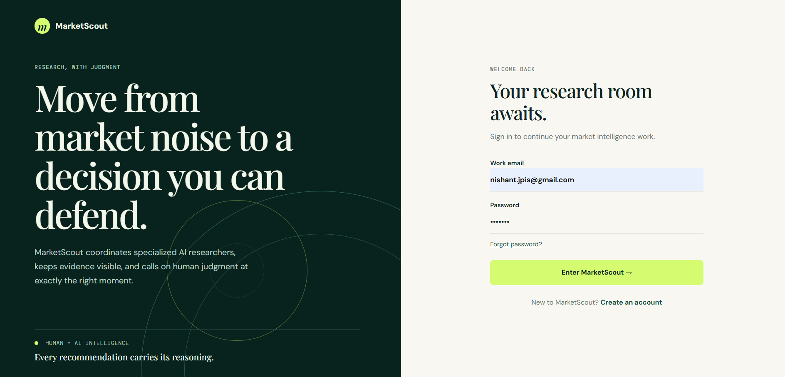
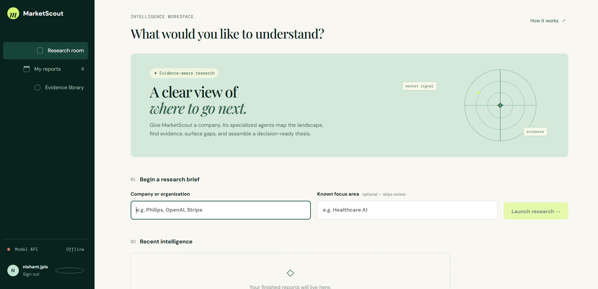
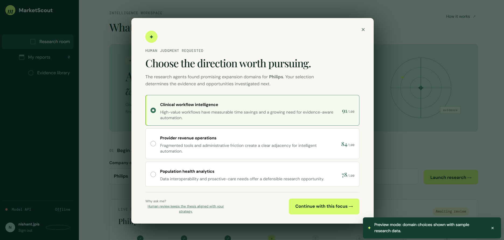
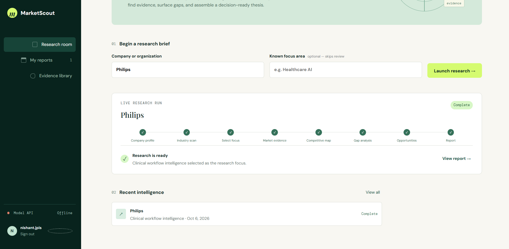

# MarketScout Frontend

> **Research with judgment.**  
> A responsive React workspace for turning market intelligence into evidence-backed, decision-ready research.

MarketScout is the frontend for an agentic market-research workflow. It coordinates a multi-stage research pipeline, keeps evidence visible, and deliberately introduces **human judgment at the strategic decision point** rather than treating the entire workflow as a black box.

---

## Product preview

### Sign in

A focused authentication experience that establishes the product's editorial, research-oriented visual language from the first interaction.



### Research workspace

The main research room lets users start a research brief with a company and an optional focus area, while keeping previous reports accessible in the same workspace.



### Human-in-the-loop domain selection

When the research agents identify promising directions, the pipeline can pause and request a strategic choice from the user. Ranked options expose the score and rationale before the run continues.



### Completed research run

Once the selected direction has been investigated, the workspace presents the completed pipeline and makes the resulting report directly accessible.



---

## Why this frontend exists

Market research is not simply a retrieval problem. MarketScout is designed around a different interaction model:

```text
User defines the question
        ↓
Specialized research agents investigate
        ↓
Evidence and opportunities are surfaced
        ↓
        HUMAN JUDGMENT
        ↓
User selects the direction worth pursuing
        ↓
Pipeline resumes from the exact thread
        ↓
Decision-ready research report
```

The frontend therefore treats the **interrupt → review → resume** flow as a first-class product experience.

---

## Core capabilities

- **Authentication**
  - Sign in and sign up through a separate authentication service.
  - Friendly user-name fallback when the auth response does not provide a name.

- **Research launch**
  - Start research with a company or organization.
  - Optionally provide a known focus area to bypass domain discovery.

- **Human-in-the-loop research**
  - Surface LangGraph-style pipeline interrupts as a focused review modal.
  - Display ranked domain options, scores, and rationales.
  - Resume the exact pipeline thread using the selected option.

- **Pipeline visibility**
  - Present the research stages as a clear progression:
    `Company profile → Industry scan → Select focus → Market evidence → Competitive map → Gap analysis → Opportunities → Report`

- **Session-level reports**
  - Keep completed research visible during the current browser session.
  - Provide direct access to completed reports from the research workspace.

- **Resilient local preview**
  - If an API is unavailable during UI development, the application remains explorable in preview mode.
  - Reachable API errors are surfaced instead of silently masking backend failures.

- **Responsive UI**
  - Responsive layouts for desktop and smaller screens.
  - No component-library dependency.
  - Custom CSS-driven visual system.

---

## Architecture

```text
┌──────────────────────────── Browser / React App ────────────────────────────┐
│                                                                            │
│  Authentication UI                 Research Workspace                      │
│          │                                  │                              │
│          ▼                                  ▼                              │
│  VITE_AUTH_API_URL               VITE_MODEL_API_URL                        │
│          │                                  │                              │
└──────────┼──────────────────────────────────┼───────────────────────────────┘
           │                                  │
           ▼                                  ▼
   ┌─────────────────┐                ┌─────────────────────────┐
   │ Authentication  │                │ MarketScout Model API  │
   │ Service         │                │ FastAPI + LangGraph    │
   ├─────────────────┤                ├─────────────────────────┤
   │ POST /auth/login│                │ GET  /health            │
   │ POST /auth/signup│               │ POST /run-pipeline      │
   └─────────────────┘                │ POST /run-pipeline/     │
                                      │      :threadId/resume   │
                                      └─────────────────────────┘
```

The model service may pause after industry analysis. When it does, the frontend receives an `interrupted` response containing a `thread_id` and ranked domain options. The selected option is then sent back to the same thread.

---

## Human-in-the-loop contract

### Start a research run

```http
POST /run-pipeline
Content-Type: application/json
```

```json
{
  "company": "Philips",
  "domain": "Healthcare AI"
}
```

The `domain` field can be omitted when the user should choose the research direction manually.

### Expected interrupt response

```json
{
  "status": "interrupted",
  "thread_id": "uuid",
  "interrupt": {
    "kind": "domain_selection",
    "options": [
      {
        "domain": "Clinical workflow intelligence",
        "score": 91,
        "rationale": "High-value workflows have measurable time savings and a growing need for evidence-aware automation."
      }
    ]
  }
}
```

### Resume the exact run

```http
POST /run-pipeline/{thread_id}/resume
Content-Type: application/json
```

```json
{
  "domain": 1
}
```

> **Important:** the frontend sends the **one-based option index**, matching the Python pipeline contract.

---

## Tech stack

| Layer | Technology |
|---|---|
| UI | React |
| Build tool | Vite |
| Language | JavaScript / JSX |
| Styling | Custom CSS |
| API integration | Fetch-based client |
| Research orchestration | FastAPI + LangGraph backend |
| Authentication | Separate authentication service |
| State | React state + browser session state |
| Component library | None |

The absence of a component library is intentional: the interface uses a small, controlled visual system instead of imposing a generic dashboard aesthetic.

---

## Project structure

```text
frontend/
├── src/
│   ├── App.jsx
│   ├── api.js
│   └── styles.css
├── public/
├── .env.example
├── package.json
└── README.md
```

### Responsibilities

| File | Responsibility |
|---|---|
| `src/App.jsx` | Screens, dashboard state, research flow, human-review modal, session report list |
| `src/api.js` | Authentication, model API calls, configurable API origins |
| `src/styles.css` | Visual system, responsive layouts, modal, dashboard and authentication styling |
| `.env.example` | Safe local configuration template |

---

## Getting started

### Prerequisites

- Node.js **20+**
- npm
- MarketScout model API running separately
- Authentication API running separately when testing real authentication

### 1. Install

```bash
cd frontend
npm install
```

### 2. Configure environment

```bash
copy .env.example .env
```

Example:

```env
VITE_MODEL_API_URL=http://localhost:8001
VITE_AUTH_API_URL=http://localhost:8000
```

### 3. Start the development server

```bash
npm run dev
```

Vite normally serves the application at:

```text
http://localhost:5173
```

### 4. Build for production

```bash
npm run build
```

---

## Environment configuration

| Variable | Default | Purpose |
|---|---|---|
| `VITE_MODEL_API_URL` | `http://localhost:8001` | MarketScout FastAPI model and research pipeline |
| `VITE_AUTH_API_URL` | `http://localhost:8000` | Authentication backend |

The authentication client currently expects:

```text
POST /auth/login
POST /auth/signup
```

If the authentication repository exposes different routes or response shapes, update `src/api.js` rather than changing the UI layer.

---

## Research flow

The frontend is intentionally aligned with the backend pipeline lifecycle:

```text
┌───────────────┐
│ Enter company │
└───────┬───────┘
        ↓
┌───────────────────┐
│ Launch research   │
└────────┬──────────┘
         ↓
┌───────────────────┐
│ Research agents   │
│ investigate       │
└────────┬──────────┘
         ↓
   ┌───────────────┐
   │ Interrupted?  │
   └───────┬───────┘
       Yes ↓
┌──────────────────────┐
│ Human review modal   │
│ ranked options       │
│ score + rationale    │
└──────────┬───────────┘
           ↓
┌──────────────────────┐
│ Resume same thread   │
└──────────┬───────────┘
           ↓
┌──────────────────────┐
│ Complete research   │
└──────────┬───────────┘
           ↓
┌──────────────────────┐
│ Decision-ready report│
└──────────────────────┘
```

---

## Design system

MarketScout deliberately avoids the visual language of a conventional analytics dashboard.

### Visual principles

**Dark evergreen**  
Used for navigation, identity, and moments requiring visual focus.

**Soft paper background**  
Keeps long-form research interactions calm and readable.

**Lime action accent**  
Reserved for primary actions, validated progress, and important calls to action.

**Editorial typography**  
Large serif headlines create a research-publication feel, while compact mono labels communicate system state and pipeline metadata.

**Evidence-first hierarchy**  
Scores, rationales, status indicators, and pipeline stages are visible without overwhelming the primary decision.

### UX principle

> **AI performs the evidence work. The user owns the strategic direction.**

That principle is reflected directly in the human-review modal rather than being hidden behind the implementation.

---

## Local preview behavior

During frontend-only development, the application remains usable even when the APIs are unavailable.

### When the API is unavailable

The UI can enter an explicitly labelled preview experience with sample research choices.

### When the API is reachable

Real API responses take precedence.

### When the API returns an error

The frontend surfaces the HTTP error rather than replacing it with fake research data.

This distinction makes the preview useful for UI development without hiding real integration problems.

---

## Production checklist

Before deploying MarketScout:

- [ ] Configure CORS for the deployed frontend origin.
- [ ] Replace session-only authentication with the backend access-token strategy.
- [ ] Persist report metadata in the backend.
- [ ] Replace the in-memory report list with an authenticated reports endpoint.
- [ ] Configure a durable LangGraph checkpointer.
- [ ] Verify interrupted runs survive process restarts and multi-worker deployments.
- [ ] Serve the production bundle over HTTPS.
- [ ] Set `VITE_MODEL_API_URL` and `VITE_AUTH_API_URL` at build time.
- [ ] Remove or restrict preview behavior for production if required by the deployment environment.
- [ ] Add automated frontend tests for authentication, pipeline interruption, resume, and error states.

---

## Engineering notes

### Why the API client is isolated

All backend integration is kept inside `src/api.js`. This creates a clean boundary between:

- UI state
- research workflow
- authentication
- API transport

It also makes it easier to move the frontend into its own repository without coupling UI components to backend implementation details.

### Why the review modal is a first-class state

The domain-selection interrupt is not treated as an error or loading state. It is a valid workflow state:

```text
RUNNING → INTERRUPTED_FOR_REVIEW → RESUMING → COMPLETED
```

This makes the frontend resilient to future agent workflows that require additional human decisions.

---

## Repository independence

The frontend is intentionally isolated from the Python model repository.

That allows:

- independent frontend deployment
- independent versioning
- separate CI/CD pipelines
- clearer ownership between product UI and AI infrastructure
- moving this application into a dedicated frontend repository without restructuring the UI

---

## Future improvements

Potential next steps include:

1. **Authenticated report persistence**
   - Store research runs server-side.
   - Load report history per user.

2. **Streaming pipeline progress**
   - Replace static progress transitions with server-sent events or WebSockets.

3. **Evidence explorer**
   - Allow users to inspect the sources and evidence behind individual research findings.

4. **Research run history**
   - Search, filter, rename, archive, and revisit previous runs.

5. **Decision audit trail**
   - Record the human decision, selected domain, timestamp, and resulting research thesis.

6. **Automated frontend testing**
   - Add unit and end-to-end coverage around the interrupt/resume lifecycle.

---

## License

Add the project's license here once the repository's distribution terms are finalized.

---

<p align="center">
  <strong>MarketScout</strong><br />
  Research with judgment.
</p>
